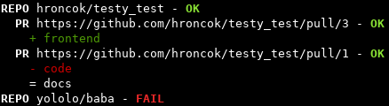

filabel
=======

`Filabel` is a tool for filename-pattern-based labeling of GitHub pull requests written in Python 3.7. It gives you an opportunity to define which labels should have pull requests that modifies particular files. The definition is done easily and exactly.

Moreover, a web application is also included to process GitHub webhooks - your labels will be always up-to-date! 

Besides, the you can import the filabel module in your Python projects. How to configure and use the filabel module is described in the documentation: https://filabel-malymar9.readthedocs.io/en/latest/ .

Installation
------------

The last stable version of filabel module can be installed `e.g.` using pip:

.. code::

   $ python -m pip install --extra-index-url https://test.pypi.org/pypi filabel

The other versions can be found at the PyPI server: https://test.pypi.org/project/filabel-malymar9/ .
