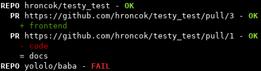

.. filabel documentation master file, created by
   sphinx-quickstart on Sat Dec  1 10:13:58 2018.
   You can adapt this file completely to your liking, but it should at least
   contain the root `toctree` directive.

filabel module - documentation
==============================

.. toctree::
   :maxdepth: 1 
   :caption: Contents:

   installation
   using
   web-app
   modular
   API
   tests

Filabel is a tool for filename-pattern-based labeling of GitHub pull requests written in Python 3.7. It gives you an opportunity to define which labels should have pull requests that modifies particular files. The definition is done easily and exactly.

Filabel can be used as a Python module, moreover, it includes a CLI for Linux shell and a web application. See :ref:`installation-label` and :ref:`using-label`.

Indices and tables
==================

* :ref:`genindex`
* :ref:`modindex`
* :ref:`search`
